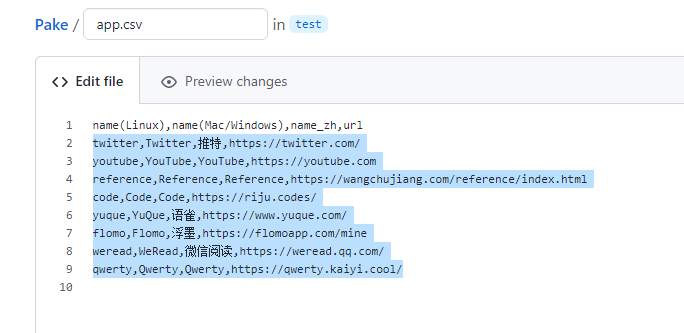
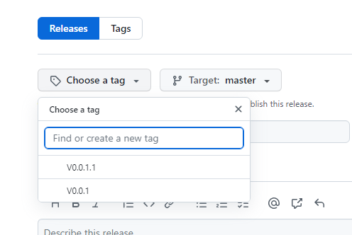
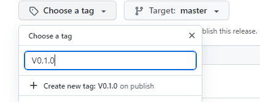

# Github actions 编译配置教程

## 1.Fork 本项目

[Fork 本项目](https://github.com/tw93/Pake/fork)

## 2.前往 actions 页面启用 GitHub actions

## 3.修改 app.csv 文件

修改 app.csv 文件，自行将第二行以后的内容替换成自定义内容

格式为：`Linux下应用名称,Mac和Windows下应用名称,中文名称,网址`，注意使用英文逗号分隔

## 4.上传图标

- 上传.icns 文件至`/src-tauri/icons`目录下（必须）
- 上传.ico 和.png 文件至`/src-tauri/png`目录下（如果使用脚本自动转换可以跳过此步）

**注意：需要两个.ico 文件和一个.png 文件，参考下表**

| 文件名称    | 说明                 |
| ----------- | -------------------- |
| app_32.ico  | 32\*32 的 ico 图标   |
| app_256.ico | 256\*256 的 ico 图标 |
| app_512.png | 512\*512 的 png 图片 |

> 你也可以直接 git 整个项目到本地，使用项目根目录下的 icns2png.py 文件批量将.icns 文件转换成.ico 和.png 文件（.icns 文件是必须的）
>
> 转换完成后别忘了将对应文件上传

## 5.更改配置文件（可选，用于进一步自定义编译好的程序）

前往`/src-tauri/`目录，修改**tauri.conf.json**文件

参考下面图片自定义配置，**推荐修改带星号的内容**，其他可以使用默认

## 6.发布以开始运行自动编译

- 点击前往 Releases 页面

- 点击**Create a new release**

- 点击**Choose a tag**，输入`V0.1.0`（版本号可自定义，但是**必须以大写 V 开头**）

- 点击下方的**Create new tag**按钮

- 填写标题和内容（可选）
- 如果不是在`master`分支修改，需要在 target 下拉栏选择对应分支
- 点击**Publish release**
- 此时，前往 actions 页面，确保出现新 workflows

在编译完成后，即可在 release 页面看到编译完成后生成的文件（编译大约需要 10-30 分钟）
