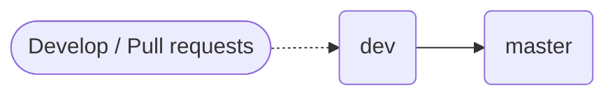

## How to contribute to Pake

**Welcome to create [pull requests](https://github.com/tw93/Pake/compare/) for bugfix, new component, doc, example, suggestion and anything.**

## Branch Management

- `dev` branch
    - `dev` is the developing branch.
    - It's **RECOMMENDED** to commit feature PR to `dev`.
- `master` branch
    - `master` is the release branch, we will make tag and publish version on this branch.
    - If it is a document modification, it can be submitted to this branch.

## Commit Log

please use <https://github.com/tw93/cz-emoji-chinese>

## More

It is a good habit to create a feature request issue to discuss whether the feature is necessary before you implement it. However, it's unnecessary to create an issue to claim that you found a typo or improved the readability of documentation, just create a pull request.
