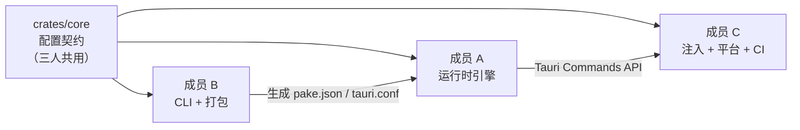

# WebPake 团队分工

> 三人团队仿照 [Pake](https://github.com/tw93/Pake) 开发的 Rust 桌面打包工具。
> 共享契约：`crates/core` 中的 `AppConfig`，任何修改需三人 Review。

---

## 分工总览



| 成员 | 职责 | 负责目录 | 状态 |
|------|------|----------|------|
| **A** | Tauri 运行时：窗口、菜单、快捷键、Commands | `crates/runtime/src/app/`、`commands.rs`、`state.rs` | ✅ 已完成 |
| **B** | CLI 命令行 + 图标/配置/构建流水线 | `crates/cli/`、`crates/packager/` | 🔲 进行中 |
| **C** | JS 注入层、三端适配、CI/CD、文档 | `crates/runtime/inject/`、`.github/`、`docs/` | 🔲 进行中 |

---

## 成员 A — 运行时引擎 ✅ 已完成

**负责人：** 成员 A  
**目录：** `crates/runtime/src/app/`、`crates/runtime/src/commands.rs`、`crates/runtime/src/state.rs`

### 已完成任务

- [x] 窗口生命周期：最大化、全屏切换、隐藏/显示、无边框拖拽区
- [x] 原生菜单：导航、缩放、缓存清理（全部接入 `events` 模块）
- [x] 全局快捷键：Ctrl+←/→、Ctrl+R、Ctrl+L、Ctrl+Shift+H、缩放、F11、DevTools
- [x] Tauri Invoke 命令（见下方 API 表）
- [x] 多窗口：`open_new_window`（需 `--multi-window`）
- [x] 隐身模式：识别 `incognito` 配置并记录日志
- [x] 系统托盘：`--system-tray` 启用，支持显示/隐藏/退出
- [x] Inject 时机：页面加载后自动重新注入脚本
- [x] 单实例：二次启动时聚焦已有窗口

### Tauri Commands API（供成员 C 调用）

| 命令 | 说明 |
|------|------|
| `get_app_config` | 返回完整 AppConfig |
| `copy_current_url` | 复制当前页面 URL 到剪贴板 |
| `navigate_home` | 跳转到首页 URL |
| `clear_cache_and_restart` | 清除缓存目录并重启 |
| `show_notification` | 发送原生通知 |
| `open_new_window` | 打开新窗口（需 multi-window 模式） |
| `hide_window` | 隐藏主窗口 |
| `toggle_fullscreen` | 切换全屏 |

### 快捷键对照表

| macOS | Windows/Linux | 功能 |
|-------|---------------|------|
| ⌘+[ | Ctrl+← | 后退 |
| ⌘+] | Ctrl+→ | 前进 |
| ⌘+Shift+H | Ctrl+Shift+H | 回首页 |
| ⌘+R | Ctrl+R | 刷新 |
| ⌘+L | Ctrl+L | 复制 URL |
| ⌘+- | Ctrl+- | 缩小 |
| ⌘+= | Ctrl+= | 放大 |
| ⌘+0 | Ctrl+0 | 重置缩放 |
| ⌘+W | Ctrl+W | 隐藏窗口 |
| F11 | F11 | 切换全屏 |
| ⌘+Shift+I | Ctrl+Shift+I | 开发者工具 |

---

## 成员 B — CLI + 打包流水线 🔲 进行中

**负责人：** 成员 B  
**目录：** `crates/cli/`、`crates/packager/`

### 待办任务（按优先级）

#### 本周必做

- [ ] **端到端打包验证**：在 Windows 上跑通 `webpake https://github.com --name GitHub`，产出可安装的 `.msi`
- [x] **构建体验**：进度提示（`[1/4]`…`[4/4]`）+ 首次编译提醒
- [x] **友好错误信息**：`cargo tauri` 未安装时给出安装提示

#### 近期任务

- [x] 补齐 CLI 参数并同步 `docs/cli-usage.md`
- [x] macOS `.icns` 正确生成（`icns` crate）
- [x] 配置文件合并：`--config-file pake.json` 与 CLI 参数合并
- [x] 三端平台配置自动生成（`tauri.*.conf.json`）
- [ ] 构建缓存：重复打包同一 App 时复用 `target/` 缓存

#### 可选增强

- [ ] `webpake list` 列出已打包应用
- [ ] `webpake init` 生成配置文件模板

### 关键文件

```
crates/cli/src/
├── main.rs       # CLI 入口
└── args.rs       # clap 参数定义

crates/packager/src/
├── pipeline.rs   # 构建编排（调用 cargo tauri build）
├── icon.rs       # Favicon 抓取
└── tauri_config.rs  # 生成 tauri.conf.json
```

### 验收标准

```bash
cargo install --path crates/cli
webpake https://github.com --name GitHub
# → 产出 .msi / .exe，双击可打开 GitHub
```

---

## 成员 C — 注入层 + 平台 + 工程化 🔲 待开始

**负责人：** 成员 C  
**目录：** `crates/runtime/inject/`、`.github/`、`docs/`、`crates/runtime/tauri.*.conf.json`

### 待办任务（按优先级）

#### 本周必做

- [x] **完善 `inject/bootstrap.js`**：剪贴板、OAuth、广告屏蔽、外链、多窗口
- [ ] **推 GitHub + CI 绿**：确认三端 `cargo check/test` 通过

#### 近期任务

- [x] 三端平台配置：`tauri.windows/macos/linux.conf.json`
- [x] Release Workflow：`.github/workflows/release.yml`
- [ ] 广告屏蔽 `--block-ads` 实测（YouTube 等）
- [x] Linux Wayland workaround 写入 `docs/faq.md`

#### 可选增强

- [ ] 示例 App 列表（见 `examples/default_apps.json`）写入 README
- [ ] Docker 在线构建支持
- [ ] 集成测试扩充至 5+ 个

### 关键文件

```
crates/runtime/inject/
└── bootstrap.js          # 注入脚本（C 主战场）

.github/workflows/
├── ci.yml                # 已有：三端 check/test
└── release.yml           # 待建：Release 发布

docs/
├── cli-usage.md
├── faq.md
└── team-division.md      # 本文件
```

### 验收标准

- `bootstrap.js` 在 GitHub.com 上：外链走系统浏览器、OAuth 不弹空白窗
- 打 `v0.1.0` tag 后 GitHub Releases 出现 Win/Mac/Linux 安装包

---

## 里程碑

| 阶段 | 时间 | 目标 | 牵头人 | 状态 |
|------|------|------|--------|------|
| **M0** | 第 1 周 | Workspace 编译通过，AppConfig 冻结 | 全员 | ✅ 完成 |
| **M1** | 第 2–4 周 | MVP：CLI 打包一个 URL 为可运行 App | B 牵头，A 支持 | 🔲 进行中 |
| **M2** | 第 5–7 周 | 快捷键、菜单、图标流水线、inject 基础版 | A + C | A ✅，C ✅ |
| **M3** | 第 8–10 周 | 三端可安装包（.msi / .dmg / .deb） | C 牵头 | 🔲 待开始 |
| **M4** | 第 11–12 周 | v0.1.0 发布 + 文档 + 示例 App | 全员 | 🔲 待开始 |

---

## 协作规则

### 配置契约（`crates/core`）

```rust
// 三人共同维护，变更需 PR Review
pub struct AppConfig {
    pub name: String,
    pub url: String,
    pub width: u32,
    pub height: u32,
    // ...
}
```

- **B 写入**：CLI 解析后生成 `pake.json`
- **A 读取**：Tauri 启动时加载
- **C 扩展**：inject 相关字段

### 接口契约

1. **A 新增 Tauri Command** → 先更新本文档 API 表 → C 再在 JS 中调用
2. **B 新增 CLI 参数** → 同 PR 更新 `docs/cli-usage.md`
3. **C 修改 inject 行为** → 同 PR 更新 `docs/faq.md`（如有用户可见变化）

### Git 分支命名

```
feat/a-<description>   # 成员 A
feat/b-<description>   # 成员 B
feat/c-<description>   # 成员 C
```

### PR 合并条件

- `cargo check --workspace` 通过
- `cargo test --workspace` 通过
- 相关文档已同步更新

---

## 本周行动清单

| 成员 | 本周必交付 |
|------|-----------|
| **A** | ✅ 已完成，可协助 B/C 联调 |
| **B** | Windows 上 `webpake url --name X` 产出可安装、可运行的包 |
| **C** | inject 在外部网页生效 + 项目推 GitHub 且 CI 通过 |

---

## 环境搭建

```bash
# 全员
git clone <repo> && cd webpake
./scripts/setup.ps1   # Windows
./scripts/setup.sh    # macOS/Linux

# 成员 B 额外需要
cargo install tauri-cli --version "^2.0"

# 成员 C 额外需要（Linux）
sudo apt install libwebkit2gtk-4.1-dev build-essential
```

## 相关文档

- [CONTRIBUTING.md](../CONTRIBUTING.md) — 贡献指南
- [docs/cli-usage.md](cli-usage.md) — CLI 完整参数
- [docs/faq.md](faq.md) — 常见问题
- [.github/ISSUE_TEMPLATE/](../.github/ISSUE_TEMPLATE/) — 各成员 Issue 模板
